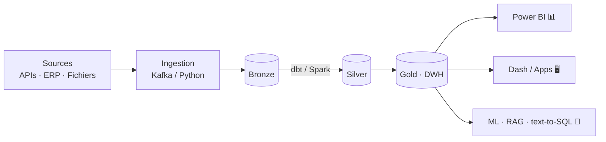

 

**🇩🇿 Algérie · 🟢 Ouvert aux missions freelance & consulting**

---

## 👋 À propos

Je conçois des plateformes de données de bout en bout : de l'ingestion et l'ETL jusqu'aux dashboards et aux applications IA qui les exploitent. Au quotidien, je travaille sur des entrepôts de données industriels, du reporting BI, des applications internes et, en freelance, sur des projets de **computer vision** et d'**outils IA**.

> Les données brutes ne valent rien — c'est la pipeline qui crée la valeur.

---

## 🎯 Ce que je fais

| | |
|---|---|
| 🏗️ **Data Engineering** | ETL/ELT, modélisation en couches (bronze/silver/gold), data warehouse SQL Server / PostgreSQL |
| 📊 **BI & Reporting** | Modèles sémantiques et dashboards Power BI, applications Dash/Plotly |
| 🤖 **IA appliquée** | OCR & vision par ordinateur, text-to-SQL / RAG, pipelines LLM structurés |
| 🔧 **Apps & IT** | Applications web internes, déploiement Docker, administration systèmes |

---

## 🛠️ Stack

**Langages** &nbsp;

**Data & orchestration** &nbsp;

**Bases de données** &nbsp;

**BI & apps** &nbsp;

**ML & IA** &nbsp;

**Infra** &nbsp;

---

## 🏗️ Architecture type

---

## 📈 Stats

---

## 🤝 Travaillons ensemble

Pipelines de données, dashboards BI, vision par ordinateur, assistants IA sur vos données : écris-moi sur [LinkedIn](https://linkedin.com/in/amazighozn) ou par [email](mailto:amazighozn1996@gmail.com).

